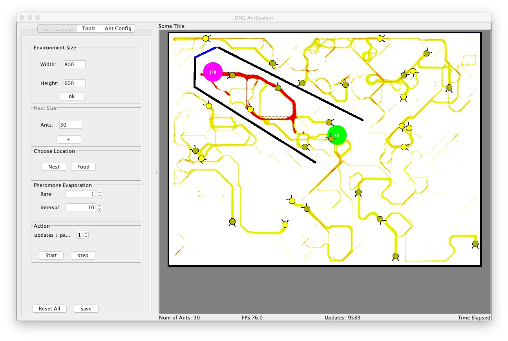


# AntSystem

AntSystem is a simulator of ants to study their behavior on foraging task, focusing on the indirect communication process through pheromones. 

This study in on the **Swarm Intelligence** field of Artificial Intelligence, and was the subject of the master's degree of Danilo N. Costa under the supervision of professor [Eduardo do Valle Simões](http://conteudo.icmc.usp.br/pessoas/simoes/) .

A copy of the master's thesis can be found [here](http://www.teses.usp.br/teses/disponiveis/55/55134/tde-16062007-095214/publico/DissertacaoFinal.pdf), but it is written in Portuguese only. If you speak Portuguese and is willing to translate it to English, please let me know =)

Please be aware that this software was written in 2005/2006 and it is uploaded as it was written. 

I am planning to do a ~~couple~~  a lot of refactoring to improve the code. 

This software may be of interest not only for the computer science community but also for the people interested on the biology side of the study. On my thesis there is a lot about the biology foundation of this subject. 

The software has a rich graphical interface for creating the environment: setting the ant colony nest, number of ants, source of food and obstacles, it also has a configuration panel to configure parameters like pheromone evaporation rate.

Here is an example: 

